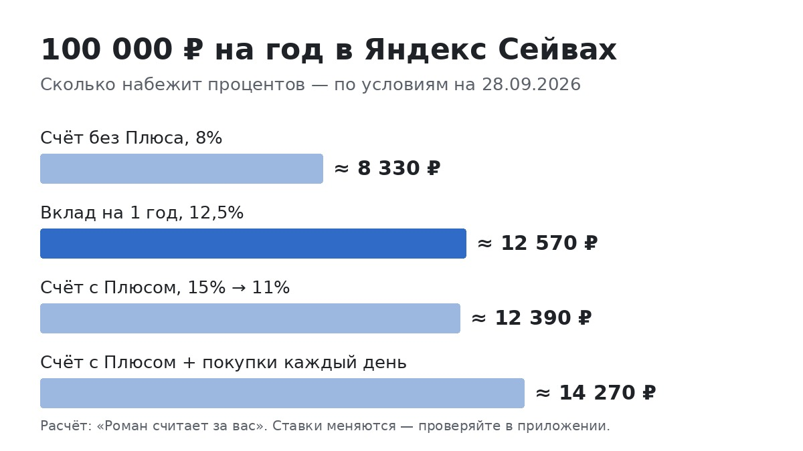

# «До 15%» в Яндекс Сейве: я разобрался, сколько на самом деле получится со 100 000 ₽

<!-- площадки: Дзен, vc.ru. Оффер: Pampadu «Яндекс Пэй — Сейвы» (2685), статьи разрешены. sub2=t02.
     Формат — «разобрался и посчитал», без выдуманного личного вклада (автор счёт не открывал).
     Условия — по vbr.ru (новость 08.07.2026 «Яндекс Сейв: новые условия и ставки») и отзывам irecommend.ru.
     Сверено с bank.yandex.ru/savings 28.09.2026 (счёт 15/13/11/8%, вклад 11–16%). Рекламодатель — АО «Яндекс Банк»,
     ИНН 7750004168 (cbr.ru). -->

После своих финансовых ошибок у меня выработалась привычка: если в рекламе написано «до», я сначала ищу, при каких
условиях будет это «до», а при каких — всё остальное. Недавно так разбирал накопительный счёт в Яндекс Сейве. Везде
написано «до 15% годовых», и это правда. Но есть нюанс, и не один.

Рассказываю, что нашёл, и считаю в рублях на трёх суммах. Условия я сверил на сайте банка 28 сентября 2026 года, в конце скажу, где их
проверить самому.

## Откуда берутся 15% и сколько они длятся

Сейв — это накопительный счёт и вклады Яндекс Банка, открываются прямо в приложении Яндекс Пэй. Со счёта без срока
можно снимать деньги когда угодно, проценты начисляют каждый день.

А теперь мелкий шрифт. С июля 2026 года ставка по счёту устроена так:

- **без подписки Яндекс Плюс** — 8% годовых. Всегда, с первого дня;
- **с Плюсом, первые 62 дня** — 15%. Это промоставка, и дают её один раз;
- **с Плюсом, с 63-го дня** — 11%;
- **с Плюсом и покупками картой Яндекс Пэй** — 13%. Причём покупка нужна каждый день: в день без покупки ставка
  опускается до 11%. Сумма покупки при этом неважна, хоть коробок спичек.

То есть «до 15%» — это два месяца для тех, у кого есть Плюс. Дальше обычная ставка, и она зависит от того, платите
ли вы за подписку и готовы ли каждый день что-то покупать картой.

Ничего плохого в этом нет, так работают почти все банки. Просто когда планируешь, надо считать не по верхней
цифре.

## Считаю на реальных суммах

Я взял три суммы и посчитал, сколько набежит за год при каждом варианте. Проценты начисляются каждый день и
прибавляются к сумме, поэтому к концу года выходит чуть больше, чем «ставка × сумма».

**50 000 ₽ на год:**
- без Плюса (8%) — около 4 160 ₽;
- с Плюсом, без ежедневных покупок (15% два месяца, потом 11%) — около 6 190 ₽;
- с Плюсом и покупками каждый день (15%, потом 13%) — около 7 130 ₽.

**100 000 ₽ на год:**
- без Плюса — около 8 330 ₽;
- с Плюсом — около 12 390 ₽;
- с Плюсом и ежедневными покупками — около 14 270 ₽.

**300 000 ₽ на год:**
- без Плюса — около 24 980 ₽;
- с Плюсом — около 37 160 ₽;
- с Плюсом и ежедневными покупками — около 42 800 ₽.

Для сравнения: те же деньги на обычной карте без процентов за год принесут ноль.

## Стоит ли ради этого покупать Плюс

Вот здесь самое интересное, и об этом почти никто не пишет.

Разница между «без Плюса» и «с Плюсом» на 100 000 ₽ — около 4 000 ₽ за год. Это примерно 340 ₽ в месяц. Значит,
если подписка стоит дороже 340 ₽ в месяц и сама по себе вам не нужна (музыка, кино, кешбэк баллами), то ради
процентов на 100 000 ₽ её покупать невыгодно. Вы просто отдадите разницу обратно Яндексу.

Если Плюс у вас уже есть, для музыки или такси, тогда повышенная ставка — просто приятный бонус.

Чем больше сумма, тем выгоднее Плюс: на 300 000 ₽ разница уже около 12 000 ₽ в год, это около 1 000 ₽ в месяц.

Цену подписки я специально не пишу: она меняется и зависит от тарифа. Посмотрите свою и сравните с цифрой выше.

## Про «покупку каждый день»

13% вместо 11% звучит заманчиво, но я честно не представляю, как не пропустить ни одного дня. Выходные, поездки,
забыл телефон. Каждый пропущенный день по этой схеме — это день по 11%.

На 100 000 ₽ разница между 11% и 13% — около 1 900 ₽ за год. Если вы и так расплачиваетесь картой Яндекс Пэй
каждый день, это бесплатные деньги. Если нет, я бы не стал перестраивать жизнь ради 160 ₽ в месяц.

## А если положить на вклад

В тех же Сейвах есть и вклад. Деньги с него до конца срока не снять, зато ставка фиксированная и, судя по
странице банка, не привязана к ежедневным покупкам. Вот что там указано на конец сентября, для суммы от 10 000 ₽:

- 2 недели — 12%, для новичков 16%;
- 3 месяца — 13,5%, для новичков 14,5%;
- 6 месяцев — 13,2%, для новичков 14%;
- 1 год — 12,5%;
- 2 года — 11%.

«Новичок» — это тот, кто раньше не пользовался Сейвами. И вот тут видно, как работает крупная цифра: 16% дают
только на две недели. Со 100 000 ₽ это около 610 ₽ — приятно, но не больше.

А на год картина интереснее. 100 000 ₽ на вкладе под 12,5% принесут около 12 570 ₽ — это почти столько же,
сколько счёт с Плюсом, только без подписки. Цена — деньги заперты на год. Если их может понадобиться снять
раньше, вклад не подходит: при досрочном закрытии проценты обычно почти теряются.

Мой вывод по этой части: если Плюса нет и деньги точно не понадобятся год, вклад выгоднее счёта примерно на
4 000 ₽ со 100 000. Если деньги — подушка на всякий случай, лучше счёт: 8% без Плюса, но снять можно в любой день.

## Что пишут люди, которые уже пользуются

Я почитал отзывы на irecommend.ru. Картина такая:

- ставку хвалят: даже обычная выше, чем в среднем по банкам;
- ругают поддержку: несколько человек пишут, что на обращения долго не отвечают;
- кому-то не понравилась процедура подтверждения личности при открытии, она показалась неудобной.

Это не повод отказываться. Но если для вас важно, чтобы поддержка отвечала быстро, держите это в голове.

## Безопасно ли

Сейв — продукт Яндекс Банка, а деньги на счетах и вкладах в российских банках застрахованы в Агентстве по
страхованию вкладов до 1,4 млн ₽ на человека в одном банке. Если сумма больше, её разумно разделить между банками.

Налог на проценты платят, только если за год они больше необлагаемого лимита. В 2026 году это 160 000 ₽ процентов
по всем банкам вместе. С сумм из этой статьи до лимита далеко.

## Мой вывод

Сейв хорош, если у вас уже есть Плюс. Тогда 11–13% на деньги, которые можно снять в любой день, — один из лучших
вариантов для подушки безопасности. Если Плюса нет, честная ставка по счёту — 8%, и её стоит сравнить с другими
банками. А если деньги точно не понадобятся год, посмотрите на вклад: 12,5% без всяких подписок.

Условия я брал на сайте банка в конце сентября 2026 года. Ставки меняются часто, так что перед открытием проверьте актуальные прямо
в приложении — там всё видно ещё до того, как вы переведёте деньги.

Открыть Сейв в Яндекс Пэй: https://trk.ppdu.ru/click/0pUVslY8?erid=2SDnjck9Tog&sub1=dzen&sub2=t02

Реклама. АО «Яндекс Банк», ИНН 7750004168. erid: 2SDnjck9Tog.

---

Я веду канал «Роман считает за вас», где так же разбираю банковские предложения и честно считаю, что реально
приносят нейросети: t.me/roman_schitaet
