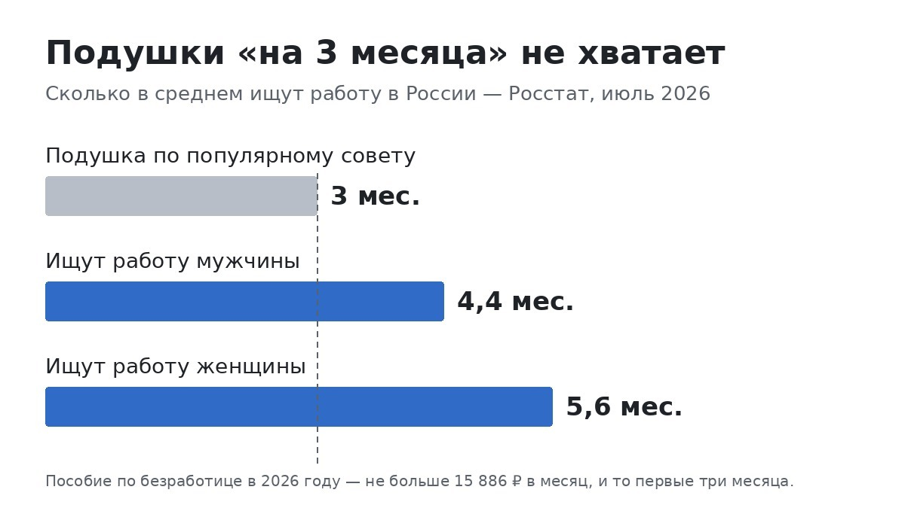
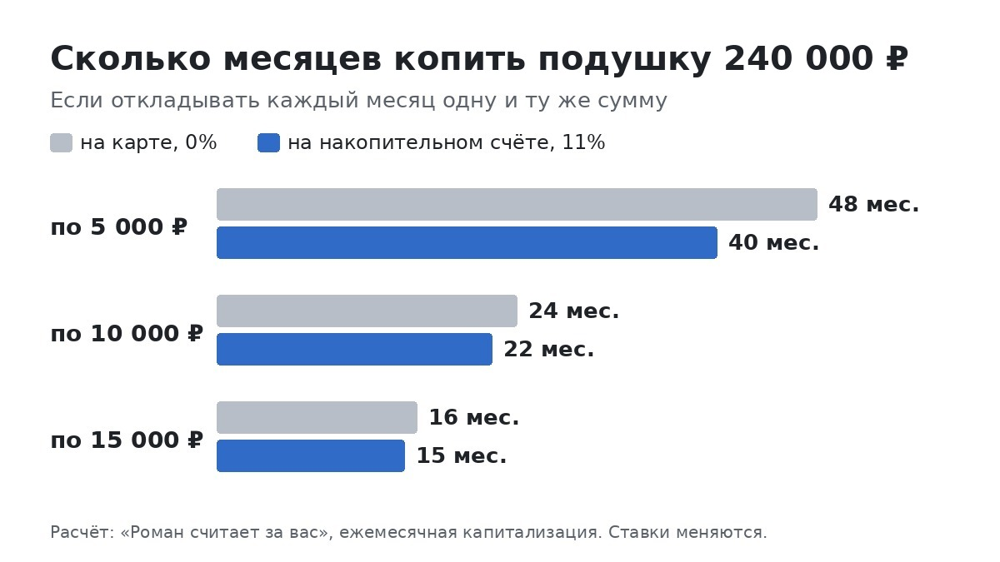

# Подушка на «три месяца» — это мало. Я посчитал, сколько нужно на самом деле и за сколько её собрать

<!-- площадка: Дзен (статья №4). Оффер: Pampadu «Яндекс Пэй — Сейвы» (2685), sub2=t03. Голос — author.md,
     формат «разобрался и посчитал», без выдуманного личного опыта.
     Источники (проверены 28.09.2026): Росстат через ТАСС/news.mail.ru 07.09.2026 (поиск работы 4,4 / 5,6 мес.,
     июль 2026); garant.ru (пособие 1 863 – 15 886 ₽, 6 209 ₽ в месяцы 4–6, условие 26 недель работы);
     Russian Field через klerk.ru 12.07.2026 (38% с подушкой, медиана 3,5 мес.); Роскачество и «Финансы Mail»
     через РИА 13.08.2026 (42% откладывают меньше 5%); прожиточный минимум 2026 — 20 644 ₽ трудоспособные,
     18 371 ₽ дети (Госуслуги, gogov.ru). Ставки Сейвов — bank.yandex.ru/savings 28.09.2026.
     Расчёт накоплений: ежемесячное пополнение, ежемесячная капитализация (упрощение ежедневной). -->

Про подушку безопасности пишут все, и почти всегда одной фразой: «отложите три–шесть месяцев расходов». Звучит
разумно. Но после своих финансовых ошибок я перестал верить фразам, за которыми не стоит расчёт. Откуда эти три
месяца? Что будет, если их не хватит? И сколько это в рублях, а не в «месяцах»?

Я сел и посчитал. Одна цифра меня откровенно удивила — про неё первый раздел.

## Сколько на самом деле ищут работу

Подушка нужна не только на поломку машины или больной зуб. Главный сценарий, ради которого её собирают, — пропал
доход. Сократили, закрылась фирма, заболел и не можешь работать.

Так вот. В сентябре ТАСС опубликовал свежие данные Росстата: в июле 2026 года безработные искали работу в среднем
**4,4 месяца мужчины и 5,6 месяца женщины**. Это среднее. У кого-то быстрее, у кого-то дольше.

А теперь положите рядом совет «отложите три месяца расходов». Получается, подушка на три месяца заканчивается
раньше, чем средний человек находит новую работу. Не у неудачника, а у среднего. Вот это меня и напрягло.

Поэтому дальше я считаю не от трёх месяцев, а от пяти. Это ближе к реальности.

## А что даст государство

Первая мысль: «Ну есть же пособие по безработице». Есть. Я посмотрел, сколько именно.

В 2026 году пособие такое:

- первые три месяца — 75% от среднего заработка, но **не больше 15 886 ₽** в месяц;
- следующие три месяца — 60%, но **не больше 6 209 ₽**;
- минимальное — 1 863 ₽.

И максимальное дают не всем: нужно, чтобы за последний год вы проработали больше 26 недель. Если меньше, если
ищете работу впервые или вас уволили за нарушение — будет минимальное. Плюс надо встать на учёт через «Работу
России» и выполнять план службы занятости.

Посчитаем по максимуму. За пять месяцев поиска это 3 × 15 886 + 2 × 6 209 = около **60 000 ₽**. За полгода —
около 66 000 ₽. На всё время.

Для сравнения: прожиточный минимум в 2026 году — 20 644 ₽ на взрослого и 18 371 ₽ на ребёнка. Семье из
четырёх человек, двое взрослых и двое детей, по этому минимуму нужно 78 030 ₽ в месяц. Не на жизнь «как
раньше», а на самый минимум.

То есть пособие — это помощь, но не опора. Рассчитывать на него как на подушку нельзя.

## Считаю, сколько нужно в рублях

Формула у меня получилась простая:

**обязательные расходы в месяц × 5 месяцев − то, что точно придёт**

«Обязательные» — это то, без чего нельзя: жильё и коммуналка, еда, проезд, связь, кредиты, лекарства, садик и
школа. Не кафе, не подписки, не одежда «потому что скидка». Если честно выписать такие траты, сумма обычно
получается меньше, чем весь месячный расход, но больше, чем хочется.

Три примера:

- **Обязательные расходы 40 000 ₽.** Пять месяцев — 200 000 ₽. Если рассчитывать на максимальное пособие, можно
  вычесть около 60 000. Остаётся примерно **140 000 ₽**.
- **60 000 ₽.** Пять месяцев — 300 000 ₽. С пособием — около **240 000 ₽**.
- **80 000 ₽.** Пять месяцев — 400 000 ₽. С пособием — около **340 000 ₽**.

Я бы считал без пособия, а пособие держал как запас на случай, если поиск затянется. Но это уже вопрос характера.

Если в семье два дохода и работу теряет один, нужная сумма меньше: вторая зарплата продолжит приходить. Тогда
считайте, сколько не хватает до обязательных расходов, и умножайте на пять.

## Если у вас подушки нет — вы в большинстве

Прежде чем расстраиваться от этих сумм, вот что пишут опросы этого года.

В исследовании Russian Field в начале лета только **38%** россиян сказали, что у них есть финансовая подушка.
Осенью прошлого года таких было 57%. У половины тех, у кого подушка есть, её хватит меньше чем на три с половиной
месяца.

В опросе Роскачества и «Финансов Mail» **42%** людей откладывают меньше 5% дохода. А идеальной подушкой больше
половины назвали годовой доход. Хотят одно, получается другое.

Я пишу это не для того, чтобы стало спокойнее от «у всех так». А чтобы было понятно: начать с нуля — нормально.
Почти все начинают с нуля.

## За сколько её реально собрать

Возьмём средний вариант из примеров — **240 000 ₽**. И три суммы, которые можно откладывать каждый месяц.

Если деньги просто лежат на карте:

- по 5 000 ₽ — **48 месяцев**, четыре года;
- по 10 000 ₽ — 24 месяца;
- по 15 000 ₽ — 16 месяцев.

Если они лежат на накопительном счёте под 11% годовых:

- по 5 000 ₽ — **40 месяцев**. На восемь месяцев быстрее, проценты доделают работу сами;
- по 10 000 ₽ — 22 месяца, и около 22 500 ₽ из итоговой суммы — это проценты;
- по 15 000 ₽ — 15 месяцев.

Для меня здесь главный вывод даже не в процентах. Главное — что с 5 000 ₽ в месяц подушка собирается годами. Это
долго, и на полпути очень легко бросить.

Поэтому я бы ставил первую цель поменьше: **один месяц обязательных расходов**. При расходах 60 000 ₽ и
пополнении по 10 000 ₽ это полгода. Уже через полгода у вас есть запас, который закрывает сломанный телефон,
внезапного стоматолога или задержку зарплаты. А дальше — второй месяц, третий, и так до пяти.

## Как не тратить эти деньги

Здесь нет секрета, всё давно известно. Но я выпишу три вещи, которые в расчётах выше заложены по умолчанию:

1. **Откладывать в день зарплаты, а не «что останется».** В конце месяца, как правило, не остаётся ничего.
   Автоперевод в день поступления денег решает вопрос силы воли.
2. **Держать подушку отдельно от карты, с которой платите.** Деньги, которые видишь каждый день, тратятся
   незаметно.
3. **Не путать подушку с копилкой на отпуск.** Если подушку потратили на отпуск, её больше нет. Для отпуска —
   отдельная цель.

## Где хранить, чтобы не пожалеть

У подушки два требования, и они немного спорят друг с другом. Деньги должны быть доступны в любой день — беда не
ждёт окончания вклада. И они не должны лежать без дела.

- **Наличные дома и обычная карта** — доступны, но ничего не приносят. За четыре года копления по 5 000 ₽ разница
  с накопительным счётом — восемь месяцев.
- **Накопительный счёт** — снять можно в любой день, проценты начисляются каждый день. Для подушки это основной
  вариант.
- **Вклад** — ставка обычно выше и зафиксирована, но деньги заперты до конца срока, а при досрочном закрытии
  проценты обычно почти теряются.
- **Акции и криптовалюта** — не для подушки. В плохой момент они как раз и стоят меньше всего.

Рабочая схема, которую советуют почти везде и которая мне кажется логичной: один-два месяца расходов держать на
накопительном счёте, а остальное можно положить на вклад на 3–6 месяцев. Если случится беда, первых месяцев хватит,
пока вклад не закончится.

И ещё одна вещь, про которую стоит помнить: деньги на счетах и вкладах застрахованы в АСВ до 1,4 млн ₽ на
человека в одном банке. Для подушки из примеров выше этого с запасом хватает.

## Какой счёт выбрать

Я недавно подробно разбирал Сейвы в Яндекс Пэй — у меня есть отдельная статья с расчётами:
https://dzen.ru/a/arpi6BbU1DLU3ULg. Если коротко, на конец
сентября там так: без подписки Плюс — 8% годовых, с Плюсом — 15% первые два месяца, потом 11%, или 13% при
ежедневных покупках картой Пэй. Снимать можно в любой день, проценты начисляются каждый день.

Это не единственный вариант, и перед открытием я бы сравнил ставку с банком, в котором у вас уже есть карта. Но
для подушки Сейвы подходят по главному критерию: деньги доступны всегда.

Открыть накопительный счёт в Сейвах: https://trk.ppdu.ru/click/0pUVslY8?erid=2SDnjck9Tog&sub1=dzen&sub2=t03

Реклама. АО «Яндекс Банк», ИНН 7750004168. erid: 2SDnjck9Tog.

## Коротко

- Работу в среднем ищут 4,4–5,6 месяца, поэтому я считаю подушку на пять месяцев, а не на три.
- Пособие по безработице — максимум около 60 000 ₽ за пять месяцев, и то не всем.
- Нужная сумма = обязательные расходы × 5 минус то, что точно придёт.
- Первая цель — один месяц расходов. Это реально за полгода.
- Хранить — на накопительном счёте, часть можно на вкладе.

Цифры в статье — по данным Росстата, опросам 2026 года и условиям банка на конец сентября. Ставки меняются, так
что перед открытием счёта проверьте актуальные.

---

Я веду канал «Роман считает за вас», где так же разбираю деньги по цифрам и честно считаю, что реально приносят
нейросети: t.me/roman_schitaet
