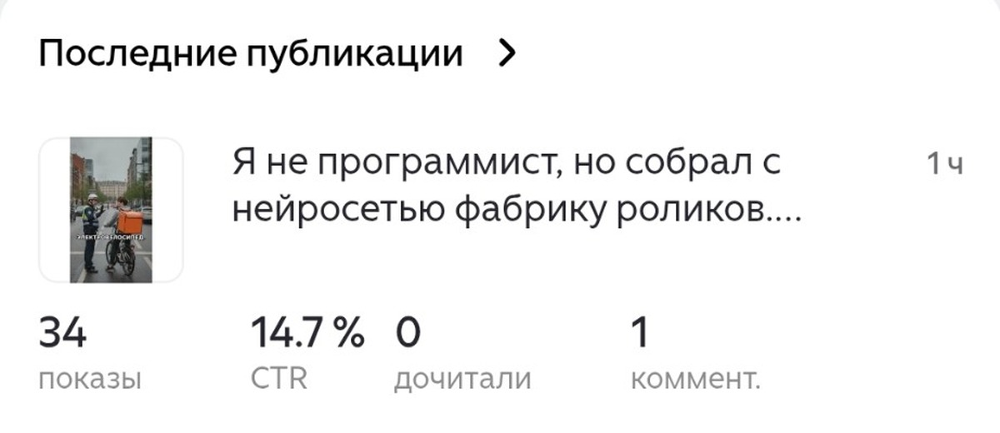
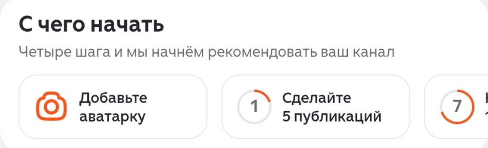

# Хотел выложить статью сразу везде — и чуть не нарвался на бан. Что нужно знать о Дзене, vc.ru и Пикабу

<!-- площадка: Дзен (статья №2). Без партнёрских ссылок. Реальные цифры первого дня канала — со скриншотов студии
     владельца 28.09.2026. Правила: dzen.ru/help/ru/monetization/conditions.html, vc.ru/rules и статья
     vc.ru/life/3037278, pikabu.ru/information/rules. Голос — docs/articles/author.md. -->

План был простой: написал статью — выложил на трёх площадках сразу, втрое больше читателей. Я уже держал текст в
буфере обмена, когда решил всё-таки открыть правила. Оказалось, на одной площадке копия чужого или уже
опубликованного текста запрещена, на другой за ссылку «не того типа» банят сразу, а на третьей за полгода можно не
увидеть ни рубля, если не знать одно условие.

Если вы тоже думаете начать писать в интернете, вот что я узнал за вечер — чтобы вам не пришлось.

Рассказываю, что узнал про три площадки, где обычно советуют начинать: Дзен, vc.ru и Пикабу. Плюс мои реальные
цифры за первый день.

## Мой первый день на Дзене

Канал я создал с нуля: ни подписчиков, ни истории. Через несколько часов после публикации статистика была такая:

- 34 показа статьи в ленте;
- CTR 14,7% — то есть примерно каждый седьмой, кому Дзен показал статью, её открыл;
- 15 просмотров, 3 лайка, 2 комментария;
- 9 подписчиков.

Сразу после создания канала Дзен показывает «С чего начать»: четыре шага, после которых он начнёт рекомендовать
канал. Добавить аватарку, рассказать о канале, сделать 5 публикаций и набрать 10 подписчиков. То есть без пяти
статей серьёзного показа в ленте не будет — это первое, что стоит знать.

## Дзен: сколько на нём можно заработать

Монетизация в Дзене подключается, когда подписчики наберут 30 часов просмотра ваших материалов за последние 30
дней. Платят только за текст — статьи и посты. Видео через обычную монетизацию не оплачивается.

Сколько платят: в обзорах пишут, что ставка сейчас около 5 копеек за минуту дочитывания. Я посчитал: если
тысяча человек прочитает статью по три минуты, это около 150 рублей. Разбогатеть на этом не получится, но как
прибавка к другим доходам — нормально.

Получать выплаты можно как физлицо, самозанятый, ИП или компания. Для меня это важно: самозанятость я пока не
оформлял.

**Что понравилось:** порог входа низкий, аудитория огромная, статьи показываются даже новичку.
**Что смущает:** пока не выполнишь четыре шага, рассчитывать на ленту не стоит, а 30 часов просмотра — это много
для маленького канала.

## vc.ru: сильная аудитория, но строгие правила

vc.ru — площадка про бизнес, технологии и деньги. Истории вроде «собрал проект и вот цифры» там заходят хорошо, и
одна удачная статья может собрать десятки тысяч просмотров.

Но вот что я вычитал в правилах и чуть не пропустил: **vc.ru принимает только оригинальные тексты.** Статью,
которая уже вышла на другой площадке, туда публиковать нельзя. Значит, мою статью про фабрику роликов просто
скопировать не получится — для vc.ru придётся писать отдельный текст.

Второй момент: блог, в котором видят признаки коммерции, могут пометить как коммерческий и ограничить, а для
снятия ограничений предложить платный тариф. На vc.ru есть свежая статья автора, которого пометили так после
текста без рекламы, с упоминанием своей компании, — ему предлагали тарифы от 40 до почти 70 тысяч рублей в
месяц. Статус вернули только после того, как он удалил статью и написал в поддержку. Совет из правил простой:
вести блог от своего имени, без логотипов компании и без рекламы услуг.

**Что понравилось:** читатели, которым интересны цифры и реальный опыт.
**Что смущает:** только уникальные тексты и риск получить «коммерческий» статус.

## Пикабу: живая аудитория, но ссылки — осторожно

Пикабу — огромное сообщество, где любят истории. Посты с личным опытом собирают тысячи оценок.

Главное правило, которое нужно знать до первого поста: **на Пикабу запрещено продвигать товары и услуги
ссылками.** Если по ссылке можно что-то купить или оформить — это бан. Ссылки на свой Telegram-канал или сайт без
продаж публиковать можно. Для бизнеса есть платная подписка, с которой коммерческие тексты разрешены.

Ещё на Пикабу своя система рейтинга: оценки постов и комментариев влияют на то, как тебя видят. Новичку лучше
сначала побыть в сообществе, а не приходить сразу со своей статьёй.

**Что понравилось:** живые люди, честная реакция, хорошо заходят истории.
**Что смущает:** строгие правила по ссылкам и свои неписаные законы.

## Что я для себя решил

1. **Дзен — основная площадка.** Здесь уже есть канал, пишу сюда регулярно и довожу до пяти статей.
2. **vc.ru — для отдельных историй про проект.** Писать туда уникальные тексты, от своего имени, без рекламы.
3. **Пикабу — позже.** Сначала освоиться, писать истории без продающих ссылок.

И главный вывод: прежде чем публиковать что-то на новой площадке, стоит прочитать её правила. Это полчаса, а
сэкономить они могут и канал, и нервы.

---

Про свой эксперимент — сколько реально приносят статьи, ролики и нейросети — пишу в Telegram-канале «Роман
считает за вас»: t.me/roman_schitaet
