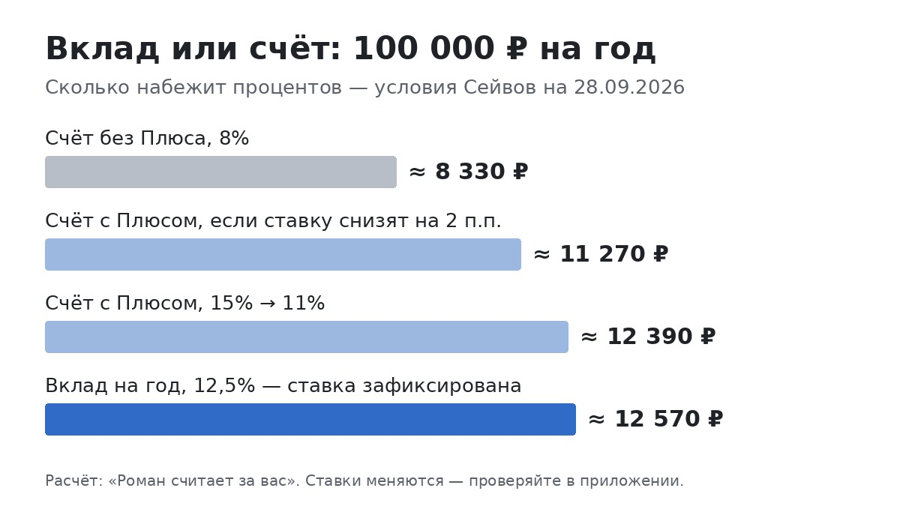

# Вклад или накопительный счёт? Я посчитал на 100 000 ₽ — и понял, что всё решает один вопрос

<!-- площадка: Дзен. Оффер: Pampadu «Яндекс Пэй — Сейвы» (2685), sub2=t08. Голос — author.md, «разобрался и посчитал».
     Источники (28.09.2026): bank.yandex.ru/savings (счёт 8% / 15% 62 дня / 11–13%; вклад 12–16%),
     ключевая ставка 14% — решение ЦБ 11.09.2026, следующее заседание 23.10.2026 (ngs.ru, gazeta.ru);
     средняя максимальная ставка топ-10 банков 13,01% — вторая декада сентября (Интерфакс по данным ЦБ);
     необлагаемый лимит процентов 2026 — 160 000 ₽ (nacio.ru).
     Расчёты: счёт — ежедневная капитализация; вклад — простые проценты в конце срока (как считает банк). -->

Недавно я разбирал накопительный счёт в Яндекс Сейве, и пока считал, у меня самого возник вопрос: «А почему не
вклад? Там же ставка выше». Я сел считать и довольно быстро понял, что спорить «что выгоднее» бессмысленно, пока
не ответишь себе на один вопрос. Про него — в конце, а сначала цифры.

Считаю на 100 000 ₽ и на одном банке, чтобы сравнение было честным: условия Сейвов в Яндекс Пэй на конец сентября
2026 года.

## Два продукта в двух словах

**Накопительный счёт** — деньги можно снять в любой день, проценты начисляются каждый день. Но ставка плавающая:
банк может поменять её когда угодно.

**Вклад** — деньги лежат до конца срока, зато ставка зафиксирована в день открытия и не меняется, что бы ни
происходило.

Всё остальное — детали. Но именно в деталях и прячутся деньги.

## Какие сейчас ставки

По накопительному счёту в Сейвах:

- без подписки Яндекс Плюс — 8%;
- с Плюсом — 15% первые два месяца, потом 11%, или 13%, если платить картой Пэй каждый день.

По вкладу, для суммы от 10 000 ₽:

- 3 месяца — 13,5%;
- 6 месяцев — 13,2%;
- 1 год — 12,5%;
- 2 года — 11%;
- для новичков на короткие сроки ставка выше, до 16% на две недели.

Для ориентира: средняя максимальная ставка по вкладам в десяти крупнейших банках во второй половине сентября —
13,01%, по данным ЦБ. То есть вклад в Сейвах — примерно на уровне рынка, не выше.

## Считаю год

Положим 100 000 ₽ на год и ничего не будем трогать.

- **Счёт без Плюса, 8%** — около 8 330 ₽.
- **Счёт с Плюсом, 15% → 11%** — около 12 390 ₽.
- **Вклад на год, 12,5%** — около 12 570 ₽.

Вклад без всяких подписок принёс чуть больше, чем счёт с Плюсом. А по сравнению со счётом без Плюса — на 4 200 ₽
больше. Для тех, у кого нет Плюса, это самая заметная цифра во всей статье.

## Но ставка по счёту может снизиться

Вот нюанс, про который редко пишут в сравнениях. В сентябре ЦБ оставил ключевую ставку на 14%, следующее
заседание — 23 октября. Если ставку начнут снижать, банки почти сразу снижают ставки по накопительным счетам. А
вклад, открытый сегодня, так и будет считаться по сегодняшней ставке.

Я прикинул простой сценарий: через полгода ставка по счёту падает на 2 процентных пункта.

- Счёт с Плюсом: вместо 12 390 ₽ получится около **11 270 ₽**.
- Счёт без Плюса: вместо 8 330 ₽ — около **7 250 ₽**.
- Вклад: как было, **12 570 ₽**.

Я не прогнозирую ключевую ставку, это не моя работа. Просто показываю, как это устроено: на вкладе вы
застраховались от снижения ставок, на счёте — нет. Зато если ставки вдруг пойдут вверх, выиграет счёт.

## Почему на два года ставка ниже, чем на год

Когда я выписывал ставки, меня сначала удивило: на три месяца — 13,5%, на год — 12,5%, а на два года — всего 11%.
Обычно же кажется, что чем дольше отдаёшь деньги банку, тем больше он должен платить.

Объяснение простое. Банк тоже считает. Если он ждёт, что ставки в экономике через год-два будут ниже, ему
невыгодно обещать вам высокий процент на долгий срок. Поэтому короткие вклады сейчас дороже длинных.

Для нас из этого следует практический вывод: длинная ставка ниже — это подсказка, куда, по мнению самого банка,
пойдут ставки. Если хочется зафиксировать доходность подольше, это и есть аргумент за вклад на год, пока ставки
не начали снижаться.

## На 300 000 ₽ разница заметнее

Те же варианты на год, но с суммой побольше:

- счёт без Плюса — около 24 980 ₽;
- счёт с Плюсом — около 37 160 ₽;
- вклад на год — около 37 710 ₽.

Разница между вкладом и счётом без Плюса — уже почти 13 000 ₽ за год. Это больше тысячи рублей в месяц просто
за то, что деньги лежат не на том продукте.

## А теперь деньги понадобились раньше

Другой сценарий. Вы положили 100 000 ₽ на год, а на четвёртом месяце сломалась машина.

- Со счёта вы просто снимаете деньги. За четыре месяца набежало около 2 710 ₽ без Плюса или около 4 450 ₽ с
  Плюсом.
- Вклад придётся закрыть досрочно. У большинства банков в этом случае проценты пересчитывают по очень низкой ставке,
  практически до нуля. Точные условия досрочного закрытия в Сейвах я бы посмотрел в документах по вкладу перед
  открытием — они есть на странице банка.

Вот и вся разница: вклад приносит больше, но только если вы до конца срока его не трогаете.

## Можно не выбирать

Мне больше всего понравился вариант, который совмещает оба. Разделить сумму:

- треть держать на накопительном счёте — это запас на всякий случай;
- две трети положить на вклад на год.

Без Плюса за год это около 2 780 ₽ со счёта и 8 380 ₽ с вклада — вместе примерно **11 160 ₽**. Больше, чем 8 330 ₽
на одном счёте, и при этом треть денег доступна в любой день.

Если хочется гибче, вклады можно открыть на разные сроки: на три месяца, на полгода, на год. Тогда какая-то
часть денег будет освобождаться регулярно.

## На что смотреть в условиях вклада

Перед открытием любого вклада, не только в Сейвах, я бы проверил четыре вещи:

1. **Что будет при досрочном закрытии.** Сохраняются ли проценты хотя бы частично или пересчитываются почти в
   ноль.
2. **Автопролонгация.** Что произойдёт в конце срока: деньги вернутся на счёт или вклад продлится — и по какой
   ставке. Продление по новой, более низкой ставке — частая причина разочарований.
3. **Можно ли пополнять и частично снимать.** Обычно чем гибче вклад, тем ниже по нему ставка.
4. **Когда выплачиваются проценты.** В конце срока или каждый месяц. Для вклада на год разница невелика, но её
   полезно знать заранее.

## Про налог

Проценты не облагаются налогом, пока за год по всем банкам они не больше 160 000 ₽ — это лимит на 2026 год.
Со 100 000 ₽ и даже с миллиона до него далеко. Если сумма большая и банков несколько, стоит сложить проценты
по всем.

И напомню про страховку: деньги на счетах и вкладах застрахованы АСВ до 1,4 млн ₽ на человека в одном банке.

## Тот самый вопрос

Вот вопрос, с которого всё начинается: **могут ли эти деньги понадобиться раньше, чем через год?**

- Если да, или вы не уверены — это подушка безопасности, и ей место на накопительном счёте. Пусть 8%, зато в
  любой день.
- Если точно нет — вклад. Сейчас он приносит больше, и ставка не упадёт, даже если ЦБ её снизит.
- Если часть денег может понадобиться, а часть точно нет — делите, как в разделе выше.

А Плюс ради процентов покупать или нет, я подробно считал в статье про Сейвы:
https://dzen.ru/a/arpi6BbU1DLU3ULg

Открыть вклад или накопительный счёт в Сейвах: https://trk.ppdu.ru/click/0pUVslY8?erid=2SDnjck9Tog&sub1=dzen&sub2=t08

Реклама. АО «Яндекс Банк», ИНН 7750004168. erid: 2SDnjck9Tog.

Условия — на конец сентября 2026 года, ставки меняются часто. Перед открытием проверьте актуальные в приложении.

---

Я веду канал «Роман считает за вас», где так же разбираю деньги по цифрам и честно считаю, что реально приносят
нейросети: t.me/roman_schitaet
